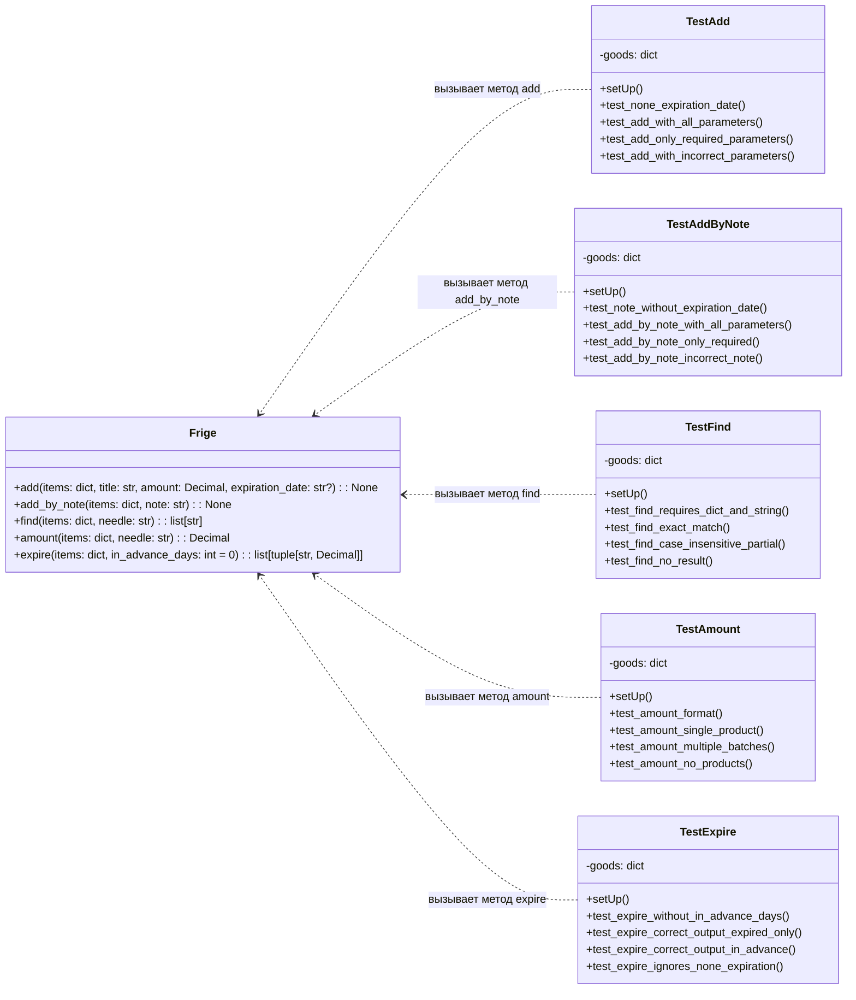

```mermaid
classDiagram
    direction RL

    %% ----- Тесты -----
    class TestAdd {
        -goods: dict
        +setUp()
        +test_none_expiration_date()
        +test_add_with_all_parameters()
        +test_add_only_required_parameters()
        +test_add_with_incorrect_parameters()
    }

    class TestAddByNote {
        -goods: dict
        +setUp()
        +test_note_without_expiration_date()
        +test_add_by_note_with_all_parameters()
        +test_add_by_note_only_required()
        +test_add_by_note_incorrect_note()
    }

    class TestFind {
        -goods: dict
        +setUp()
        +test_find_requires_dict_and_string()
        +test_find_exact_match()
        +test_find_case_insensitive_partial()
        +test_find_no_result()
    }

    class TestAmount {
        -goods: dict
        +setUp()
        +test_amount_format()
        +test_amount_single_product()
        +test_amount_multiple_batches()
        +test_amount_no_products()
    }

    class TestExpire {
        -goods: dict
        +setUp()
        +test_expire_without_in_advance_days()
        +test_expire_correct_output_expired_only()
        +test_expire_correct_output_in_advance()
        +test_expire_ignores_none_expiration()
    }

    %% ----- Основной класс (ниже всех тестов) -----
    class Frige {
        +add(items: dict, title: str, amount: Decimal, expiration_date: str?): None
        +add_by_note(items: dict, note: str): None
        +find(items: dict, needle: str): list[str]
        +amount(items: dict, needle: str): Decimal
        +expire(items: dict, in_advance_days: int = 0): list[tuple[str, Decimal]]
    }

    %% Зависимости тестов от Frige
    TestAdd ..> Frige : вызывает метод add
    TestAddByNote ..> Frige : вызывает метод add_by_note
    TestFind ..> Frige : вызывает метод find
    TestAmount ..> Frige : вызывает метод amount
    TestExpire ..> Frige : вызывает метод expire

```